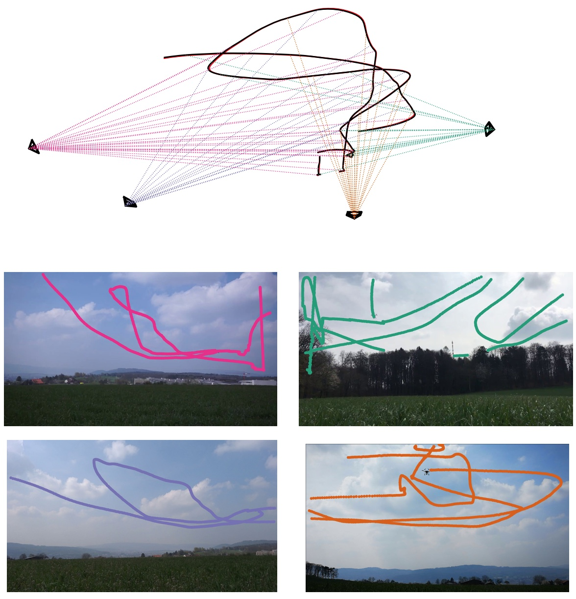

# MultiViewUnsynch
Tracking and trajectory reconstruction of moving objects using multiple unsynchronized cameras 

<p align="center">

</p>

# Inputs

## Reconstruction configuration file
The reconstruction configuration file initializes the settings and defines the data regarding the 2D tracks and cameras that are used in the flight reconstruction. The file shall be in json format. An example config file is as follows:

```
{
    "comments":
    [
        "betas: Sony G: 3516", 
        " Mate 10: 0 "
    ],

    
    "necessary inputs":
    {
        "path_detections": ["drone-tracking-datasets/dataset4/detections/cam2.txt",
                            "drone-tracking-datasets/dataset4/detections/cam3.txt",
                            "drone-tracking-datasets/dataset4/detections/cam0.txt",
                            "drone-tracking-datasets/dataset4/detections/cam1.txt",
                            "drone-tracking-datasets/dataset4/detections/cam4.txt",
                            "drone-tracking-datasets/dataset4/detections/cam5.txt",
                            "drone-tracking-datasets/dataset4/detections/cam6.txt"],

        
        "path_cameras": ["drone-tracking-datasets/calibration/mate7/mate7.json",
                         "drone-tracking-datasets/calibration/mate10/mate10_2.json",
                         "drone-tracking-datasets/calibration/gopro3/gopro3.json",
                         "drone-tracking-datasets/calibration/p20pro/p20pro.json",
                         "drone-tracking-datasets/calibration/sony5100/sony5100.json",
                         "drone-tracking-datasets/calibration/sonyG/sonyG_2.json",
                         "drone-tracking-datasets/calibration/sony5n_1440x1080/sony5n_1440x1080.json"],
                    
        "corresponding_frames":[0, 92, -2255, 32, -238, 1136, -2502]
    },


    "optional inputs":
    {
        "ground_truth": {"filepath":"drone-tracking-datasets/dataset4/trajectory/rtk.txt", "frequency":5}
    },


    "settings":
    {
        "num_detections": 100000,
        "opt_calib": false,
        "cf_exact": true,
        "undist_points": true,
        "rolling_shutter": true,
        "init_rs": [0.6,0.75,0.5,0.1,0.1,0.1,0.1],
        "motion_type":"F",
        "motion_reg":true,
        "motion_weights":1e4,
        "rs_bounds":false,
        "cut_detection_second": 0.5,
        "camera_sequence": [],
        "ref_cam": 0,
        "thres_Fmatix": 30,
        "thres_PnP": 30,
        "thres_outlier": 10,
        "thres_triangulation": 20,
        "smooth_factor": [10,20],
        "sampling_rate": 0.5,
        "path_output": "drone-tracking-datasets/dataset4/result_f_rs.pkl"
    }
}
```

## 2D Detections for each Camera
text files containing 2D detections from each camera. The file should contain 
one detection per row, with each row containing three columns in the following order:

x-coordinate,y-coordinate, frame-id

## Camera Intrinsic Parameter json Files
Each camera in the network should have a corresponding calibration file in json format containing the following information as shown in the example below:
```
{
    "comment":["Templete for providing camera information.",
               "The path of this file should be included in the 'config.json' file under 'path_cameras'",
               "K-matrix should be a 3*3 matrix",
               "distCoeff should be a vector of [k1,k2,p1,p2[,k3]]"],

    "K-matrix":[[874.4721846047786, 0.0, 970.2688358898922], [0.0, 894.1080937815644, 531.2757796052425], [0.0, 0.0, 1.0]],

    "distCoeff":[-0.260720634999793, 0.07494782427852716, -0.00013631462898833923, 0.00017484761775924765, -0.00906247784302948],
           
    "fps":59.940060,

    "resolution":[1920,1080]

}
```
- "K-matrix": 3*3 matrix of intrinsic camera parameters in the form:

<p align="left">

</p>

    where:
        - (cx, cy) is a principal point that is usually at the image center.
        - fx, fy are the focal lengths expressed in pixel units.

- "distCoeff": a vector of [k1,k2,p1,p2[,k3]]
    
    where:
        - k1, k2, k3 are radial distortion coefficients. 
        - p1 and p2 are tangential distortion coefficients. 

- "fps": nominal fixed frame rate of the camera

- "resolution": sensor resolution of the camera


# Outputs

- Reconstructed trajectory of the detected object


## For developing

Folder and file structure:

./multiviewunsynch - main directory for the project, contains modules, please keep functionality in separate modules based on topic, i.e.

./thirdparty - this is where you put code that is not ours

./deprecated - previous codes that are not used anymore. This folder only temporarily keeps these codes and should be as clean as possible. For any on-going scripts, please keep them in a separate personal branch.

./imput_template.json - template file for loading input data. NOT FINISH YET.

GUIDELINES:

Main branch for developing is dev.

For each new functionality that you start proramming (e.g. epipolar geometry estimation) create a new branch. When your function is ready and tested, merge the branch to dev.

Don't merge to master.

Provide documentation for your code, see the example function x_() in ./multiviewunsynch/geometry.py


