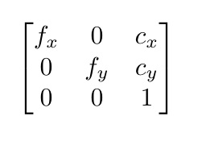

# MultiViewUnsynch
3D trajectory reconstruction of moving objects using multiple unsynchronized cameras. Requires 2D detections of a moving object in 2+ cameras with sufficient time overlap and reconstructs the objects 3D trajectory along with the camera poses. Only single target currently supported. 

If you use this software for your research, please cite [our paper](https://arxiv.org/abs/2003.04784).

[Here](https://github.com/CenekAlbl/drone-tracking-datasets) you can find the dataset we used for our experiments.

<p align="center">

</p>

## Table of Contents
- [Inputs](#inputs)
  * [Configuration JSON file](#configuration-json-file)
    + [comments](#comments)
    + [necessary inputs](#necessary-inputs)
    + [optional inputs](#optional-inputs)
    + [settings](#settings)
  * [2D Detection Tracks](#2d-detection-tracks)
  * [Intrinsic Camera Parameters](#intrinsic-camera-parameters)
- [Outputs](#outputs)
  * [Attributes](#attributes)
  * [Sub-attributes](#sub-attributes)
    + [cameras](#cameras)
    + [out](#out)
    + [settings](#setting)
    + [spline](#spline)
    + [traj](#traj)
    + [visible](#visible)

<!-- toc -->

# Inputs

### Configuration JSON file
The reconstruction configuration file initializes the settings and defines the data regarding the 2D tracks and cameras that are used in the flight reconstruction. The file shall be in json format. An example config file is as follows:

```
{
    "comments":
    [
        "betas: Sony G: 3516", 
        " Mate 10: 0 "
    ],

    
    "necessary inputs":
    {
        "path_detections": ["drone-tracking-datasets/dataset4/detections/cam2.txt",
                            "drone-tracking-datasets/dataset4/detections/cam3.txt",
                            "drone-tracking-datasets/dataset4/detections/cam0.txt",
                            "drone-tracking-datasets/dataset4/detections/cam1.txt",
                            "drone-tracking-datasets/dataset4/detections/cam4.txt",
                            "drone-tracking-datasets/dataset4/detections/cam5.txt",
                            "drone-tracking-datasets/dataset4/detections/cam6.txt"],

        
        "path_cameras": ["drone-tracking-datasets/calibration/mate7/mate7.json",
                         "drone-tracking-datasets/calibration/mate10/mate10_2.json",
                         "drone-tracking-datasets/calibration/gopro3/gopro3.json",
                         "drone-tracking-datasets/calibration/p20pro/p20pro.json",
                         "drone-tracking-datasets/calibration/sony5100/sony5100.json",
                         "drone-tracking-datasets/calibration/sonyG/sonyG_2.json",
                         "drone-tracking-datasets/calibration/sony5n_1440x1080/sony5n_1440x1080.json"],
                    
        "corresponding_frames":[0, 92, -2255, 32, -238, 1136, -2502]
    },


    "optional inputs":
    {
        "ground_truth": {"filepath":"drone-tracking-datasets/dataset4/trajectory/rtk.txt", "frequency":5}
    },


    "settings":
    {
        "num_detections": 100000,
        "opt_calib": false,
        "cf_exact": true,
        "undist_points": true,
        "rolling_shutter": true,
        "init_rs": [0.6,0.75,0.5,0.1,0.1,0.1,0.1],
        "motion_type":"F",
        "motion_reg":true,
        "motion_weights":1e4,
        "rs_bounds":false,
        "cut_detection_second": 0.5,
        "camera_sequence": [],
        "ref_cam": 0,
        "thres_Fmatix": 30,
        "thres_PnP": 30,
        "thres_outlier": 10,
        "thres_triangulation": 20,
        "smooth_factor": [10,20],
        "sampling_rate": 0.5,
        "path_output": "drone-tracking-datasets/dataset4/result_f_rs.pkl"
    }
}
```
#### A description of each section in the configuration file is as follows:

#### comments
notes/information on the reconstruction configuration 

#### necessary inputs
| Flag  | Description |
| ------------- | ------------- |
| "path_detections" | path to 2D detections for each camera  |
| "path_cameras"  | path to calibration JSON files for each camera |
| "corresponding_frames"  | initial corresponding frame indicies between camera streams|

#### optional inputs
| Flag  | Description |
| ------------- | ------------- |
| "ground_truth" | path to ground truth trajectory data if available |

### settings
| Flag    | Description |
| ------------- | ------------- |
| "num_detections": int | maximum number of detections to load from each camera track  |
| "opt_calib" : *true/false*  | determines whether to optimize the intrinsic camera parameters |
| "cf_exact" : *true/false*  | determines whether to use the exact corresponding frames offsets provided or to optimize them  |
| "undist_points" : *true/false* | determines whether to undistort the 2D detections  |
| "rolling_shutter" : *true/false* | determines whether to apply rolling shutter correction  |
| "init_rs": *int/float list* | determines initial rolling shutter correction value applied to each camera  |
| "rs_bounds" : *true/false* | determines whether to bound rolling shutter read out speed to between 0 and 1 |
| "motion_reg" : *true/false* | determines whether to apply motion prior regularization to the reconstruction |
| "motion_type" : *"F"* or *"KE"* | determines whether to apply least force (*"F"*) or least kinetic energy (*"KE"*) regularization |
| "motion_weights" : *int/float*  | weight factor to apply to the motion prior regularization error term  |
| "cut_detection_second"  | number of seconds to remove from each contiguous detection track to reduce influence of misdetections when the object leaves the field of view  |
| "camera_sequence": * default [] or optional list*  | optional list to fix the order in which camera detections are added to the reconstruction. The camera detections will be automatically determined based on the number of inlier correspondences in the even an empty list, *[]*, is provided.     |
| "ref_cam": *int*  | determines which camera in the network to start the reconstruction with  |
| "thres_Fmatix"  | The maximum distance from a point to an epipolar line in pixels, beyond which the point is considered an outlier and is not used for computing the final fundamental matrix. See:[cv2 findFundametalMat](https://docs.opencv.org/2.4/modules/calib3d/doc/camera_calibration_and_3d_reconstruction.html#findfundamentalmat)  |
| "thres_PnP"  | Inlier threshold value used by the opencv solvePnPRANSAC procedure. The parameter value is the maximum allowed distance between the observed and computed point projections to consider it an inlier. See:[cv2 solvePnPRANSAC, reprojectionError](https://docs.opencv.org/2.4/modules/calib3d/doc/camera_calibration_and_3d_reconstruction.html#findfundamentalmat) |
| "thres_outlier" | Maximum reprojection error in pixels beyond which an associated 2D detection is removed from a given camera track. |
| "thres_triangulation"  | Maximum reprojection error in pixels below which an associated triangulated 3D point is added to the trajectory.  |
| "smooth_factor": *list length 2* | Defines the minimum and maximum ratio between the number of points described by a spline and the number of knots used to parameterize that spline. These thresholds are used to scale the smoothness factor within the spline function that controls the balance between closeness of fit and smoothness of the spline. See: [scipy.interpolate.splprep](https://docs.scipy.org/doc/scipy-0.14.0/reference/generated/scipy.interpolate.splprep.html)|
| "sampling_rate": *default 1*  | time step interval at which the set of splines representing the reconstructed trajectory is sampled to obtain a discrete set of 3D points. |
| "path output" | path of the saved reconstruction result as a pickle file |


### 2D Detection Tracks
text files containing the 2D detections of the target for each camera. The file should contain 
one detection per row, with each row/detection containing three columns in the following order:

|**x-coordinate**|**y-coordinate**|**frame-id**|

**Example**:

```
525 313 923
526 311 924
524 309 925
524 307 926
523 305 927
522 303 928
521 301 929
521 299 930
521 297 931
520 294 932
```

### Intrinsic Camera Parameters
Each camera in the network should have a corresponding calibration file in **JSON** format containing the following information as shown in the example below:
```
{
    "comment":["Templete for providing camera information.",
               "The path of this file should be included in the 'config.json' file under 'path_cameras'",
               "K-matrix should be a 3*3 matrix",
               "distCoeff should be a vector of [k1,k2,p1,p2[,k3]]"],

    "K-matrix":[[874.4721846047786, 0.0, 970.2688358898922], [0.0, 894.1080937815644, 531.2757796052425], [0.0, 0.0, 1.0]],

    "distCoeff":[-0.260720634999793, 0.07494782427852716, -0.00013631462898833923, 0.00017484761775924765, -0.00906247784302948],
           
    "fps":59.940060,

    "resolution":[1920,1080]

}
```
#### A description of each section in the calibration file is as follows:

| Flag  | Description |
| ------------- | ------------- |
| "K-matrix" | 3*3 matrix of intrinsic camera parameters in the form:
<p align="left">

</p>

    where:
        - (cx, cy) is a principal point that is usually at the image center.
        - fx, fy are the focal lengths expressed in pixel units.

|  Flag | Description  |
| ------------- | ------------- |
| "distCoeff" | a vector of ```[k1,k2,p1,p2[,k3]]``` where k1, k2, k3 are radial distortion coefficients and p1 and p2 are tangential distortion coefficients. |
| "fps"| nominal fixed frame rate of the camera |
| "resolution" | sensor resolution (x,y)  of the camera |


# Outputs

#### The output object of the bundle adjustment procedure contains the following attributes:
### Attributes
| Attribute  | Description |
| ------------- | ------------- |
| alpha | optimized nominal frame rate of each network camera|
| beta  | optimized relative time offset between each camera and the reference camera |
| beta_after_Fbeta  | initial time offset estimate between each camera and the reference camera as determined by the fundamental matrix/time offset minimal solver|
| cameras  | optimized [parameters](#cameras) describing each network camera |
| cf  | initial corresponding frame indicies between camera streams|
| detections  | 2D detections for each camera with camera time stamps. |
| detections_global  | 2D detections for each camera with global time stamps relative to the reference camera.|
| detections_raw  | |
| find_order: *True/False* | defines whether the order of camera additions were defined automatically or manually|
| frame_id_all  | combined frame_ids from all network cameras|
| global_detections  | combined detections from all cameras with global time stamps|
| global_time_stamps_all | combined global timestamps from all network cameras|
| global_traj  | a combined set of 3D points interpolated from the global stamps of each camera|
| gt| *optional* file location and sampling frequency of the ground-truth 3D trajectory for reconstruction accuracy evaluation.|
| out  | output 3D trajectory transformed to the provided ground-truth. See [out](#out). |
| ref_cam | index of the camera in the network that is used as the reference camera. Default is 0.|
| rs  | optimized rolling-shutter read-out speed for each camera|
| sequence | sequence of camera indexes arranged in the order in which they were added to the reconstruction|
| settings | initial settings that were applied in the reconstruction as defined in the config JSON file. |
| spline| time-step interval over which a spline was fit to the trajectory and the spline parameters that describe the spline for each interval.|
| traj  | set of 3D points sampled from the reconstruction splines|
| traj_len | number of points in the sampled trajectory.|
| visible  | bool defining whether a given camera detection is visible within a spline interval.|

#### The following output attributes contain the following sub-attributes:

### Sub-attributes
#### cameras
The following parameters are defined for each camera included in the reconstruction:

| Attribute  | Description |
| ------------- | ------------- |
| K | 3*3 matrix of optimized intrinsic camera parameters |
| P | 2D-3D projection matrix |
| R | camera rotation matrix |
| c | camera center coordinates |
| d | radial distortion coefficients |
| fps | nominal fixed frame rate of the camera |
| resolution | sensor resolution (x,y)  of the camera |
| t | translation vector of the camera |

#### out
| Attribute  | Description |
| ------------- | ------------- |
| align_param | Array defining the optimized time scale and time offset values determined in the alignment operation between the reconstruction and the ground truth. |
| error | 3D error (meters) between the reconstructed trajectory points and the provided ground-truth data.  |
| gt | Set of measured 3D ground truth measurements describing the trajectory. |
| reconst_tran | Set of transformed reconstructed 3D points used to compare to the ground truth. |
| tran_matrix | Transformation matrix determined to transform the reconstructed 3D points into the ground truth frame of orientation. |

### settings
| Flag    | Description |
| ------------- | ------------- |
| "camera_sequence": * optional list*  | List defining the order in which camera detections were added to the reconstruction. *Default [].*| 
| "cf_exact" : *True/False*  | Defines whether the corresponding frame offsets provided in the config file were used in the reconstruction or whether the solved values from the minimal solver were used. |
| "cut_detection_second": *int*  | Number of seconds that were removed from each contiguous detection track to reduce influence of misdetections when the object leaves the field of view.  |
| "init_rs": *int/float list* | Defines rolling shutter correction values determined for each camera after the reconstruction.  |
| motion_reg : *True/False* | Defines whether motion prior regularization was applied to the reconstruction. |
| "motion_type" : *"F"* or *"KE"* | Defines whether the least force (*"F"*) or least kinetic energy (*"KE"*) regularization was applied in reconstruction |
| "motion_weights" : *int/float*  | Weight factor applied to the motion prior regularization error term  |
| "num_detections": *int* | maximum number of detections loaded from each camera track.  |
| "opt_calib" : *True/False*  | Defines whether the intrinsic camera parameters were optimized in the reconstruction. |
| "path output" | Path of the reconstruction result saved as a pickle file |
| "ref_cam": *int*  | Defines which camera in the network the reconstruction was started with.  |
| "rolling_shutter" : *True/False* | Defines whether rolling shutter distortion correction was applied during the reconstruction  |
| "rs_bounds" : *True/False* | Defines whether rolling shutter read out speed was bound between 0 and 1 |
| "sampling_rate": *int/float* | Time step interval at which the set of splines representing the reconstructed trajectory was sampled to obtain a discrete set of 3D points. *default 1*|
| "smooth_factor": *list length 2* | Defines the minimum and maximum ratio between the number of points described by a spline and the number of knots used to parameterize that spline. See [Inputs>settings>smooth_factor](#settings) |
| "thres_Fmatix": *int/float*  | The maximum distance from a point to an epipolar line in pixels, beyond which the point is considered an outlier and is not used for computing the final fundamental matrix. See:[Inputs>settings>thres_Fmatix](#settings) |
| "thres_PnP": *int/float*  | Inlier threshold value used by the opencv solvePnPRANSAC procedure. The parameter value is the maximum allowed distance between the observed and computed point projections to consider it an inlier. See:[Inputs>settings>thres_PnP](#settings) |
| "thres_outlier": *int/float* | Maximum reprojection error in pixels beyond which an associated 2D detection was removed from a given camera track. |
| "thres_triangulation" : *int/float* | Maximum reprojection error in pixels below which an associated triangulated 3D point was added to the trajectory.  |
| "undist_points" : *True/False* | defines whether the 2D detections were undistorted   |


### spline
| Flag    | Description |
| ------------- | ------------- |
| int | Time intervals over which the set of splines that describe the trajectory are defined. |
| tck | A tuple (t,c,k) containing the vector of knots, the B-spline coefficients, and the degree of the spline. See: [scipy.interpolate.splprep](https://docs.scipy.org/doc/scipy-0.14.0/reference/generated/scipy.interpolate.splprep.html) |

### traj
The set of 3D points that are interpolated from the set of splines that describe the reconstructed trajectory. 

### visible
Attribute defining which spline interval a given detection is visible in for each 2D camera track.  

# Acknowledgement
The software was written by Jingtong Li and Jesse Murray, supervised by Cenek Albl and Konrad Schindler in the group of Photogrammetry and Remote Sensing, ETH Zurich.


